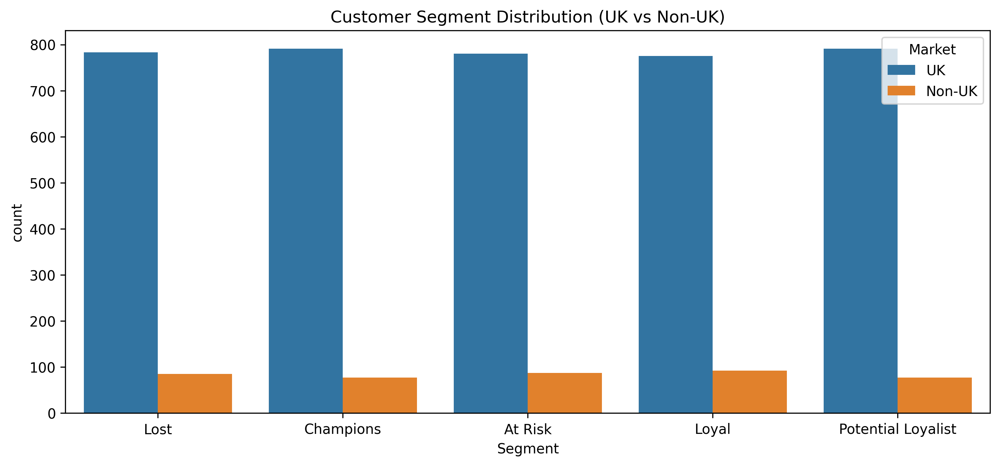
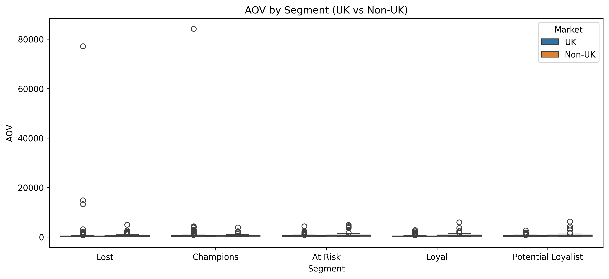

# Customer-Segmentation-with-RFM

## 1. Project Overview
This project applies **RFM (Recency – Frequency – Monetary) analysis** to segment customers of a **global online retail company** and support the Marketing team in designing **targeted end-of-year campaigns** (Christmas & New Year).

Due to the large dataset size, manual segmentation using Excel is no longer feasible.  
The objective is to build a **scalable, unbiased, and explainable segmentation pipeline in Python**, accompanied by **clear business insights and actionable recommendations**.

## 2. Business Problem
The Marketing team aims to:
- Reward loyal and high-value customers
- Convert potential customers into loyal ones
- Re-engage customers at risk of churn
- Avoid generic campaigns that may cause customer fatigue

**Key challenge:**  
The dataset is **heavily dominated by UK customers**, which can bias insights if analyzed globally without market control.

## 3. Dataset Description
**Online Retail Dataset**  
Transactions from **01/12/2010 to 09/12/2011**

Main fields:
- `InvoiceNo` – Invoice identifier (starting with “C” indicates cancellation)
- `StockCode` – Product code
- `Quantity` – Number of items purchased
- `InvoiceDate` – Transaction date
- `UnitPrice` – Price per unit
- `CustomerID` – Unique customer identifier
- `Country` – Customer country

## 4. Analytical Approach

### 4.1 Data Cleaning
- Removed records with missing `CustomerID`
- Excluded cancelled invoices
- Filtered out invalid transactions (`Quantity ≤ 0`, `UnitPrice ≤ 0`)
- Created transaction revenue (`Amount = Quantity × UnitPrice`)

### 4.2 RFM Construction
RFM metrics were calculated **per customer** using a fixed snapshot date:

- **Recency:** Days since last purchase (as of **31/12/2011**)
- **Frequency:** Number of unique invoices
- **Monetary:** Total spending

Each metric was scored from **1 to 5** using **quintile segmentation**, producing:
- `RFM_Code` (e.g. `555`, `431`)
- `RFM_Total` (range 3–15)

## 5. Bias Control: UK vs Non-UK Market Split
The dataset is dominated by customers from the **United Kingdom**.  
If all customers are analyzed together, UK behavior will dominate insights, leading to **market bias**.

**Solution:**
- Assign each customer a **Primary Country** based on highest revenue contribution
- Split analysis into **UK** and **Non-UK** groups

This ensures insights are comparable **within similar market contexts**.

## 6. Customer Segmentation
Customers were mapped into business-meaningful segments based on RFM patterns, including:
- Champions
- Loyal
- Potential Loyalists
- At Risk
- Lost

This segmentation captures both **customer value** and **churn risk**.

## 7. Segment Profiling (Beyond RFM Scores)
To avoid purely score-based conclusions, each segment was profiled using behavioral metrics:
- **AOV (Average Order Value)**
- **Items per Order**
- **Distinct SKU per Order**
- **Average Recency**
- **Revenue contribution**

This profiling helps determine whether **upsell/cross-sell strategies are appropriate** or may cause offer fatigue.

## 8. Visualization

The project includes visualizations to support data storytelling:
- Customer distribution by segment (UK vs Non-UK)
- AOV comparison by segment and market
- **Heatmap of segment profiles**, highlighting behavioral differences

## 9. Key Insights
- **UK dominates the dataset**, so global analysis without market split is biased.
- **High-value customers are not always upsell-friendly** due to already large basket sizes.
- **At Risk** and **Lost** customers require different reactivation strategies based on historical value.

## 10. Recommendations

### Champions
- VIP early access and thank-you rewards
- Curated bundles instead of aggressive upselling
- Free shipping thresholds slightly above current AOV

### Loyal Customers
- Loyalty programs and reorder reminders
- Carefully designed bundles to increase AOV

### Potential Loyalists
- Time-limited incentives to trigger second purchase
- Focus on best-selling products

### At Risk
- Win-back campaigns with limited-time vouchers
- Personalized recommendations based on past purchases

### Lost Customers
- Low-cost seasonal reactivation campaigns
- Avoid heavy marketing investment

## 11. Deliverables
- **Jupyter Notebook:** End-to-end RFM pipeline and visualization
- **Excel Output:** Clean data, RFM table, and segment profiling
- **Charts:** Distribution plots and heatmaps for storytelling

## 12. Tools & Technologies
- Python (pandas, numpy)
- Data Visualization (matplotlib, seaborn)
- Environment: Google Colab / Jupyter Notebook

## 13. Business Value
This project enables the Marketing team to:
- Move from generic campaigns to **data-driven, customer-centric strategies**
- Reduce churn risk
- Improve campaign efficiency
- Avoid market and behavioral bias in decision-making

